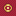

# 顶格礼遇 / Overprotocol



**Minecraft Java 1.21.1 · NeoForge · Java 21**

从一条红毯开始，一不小心把 B-2 也造出来了。
It started with a red carpet. Somehow, we ended up building a B-2.

## 中文

礼宾主题模组，包含装饰家具、自定义皮肤仪仗队和真实比例的可驾驶 B-2。此仓库是完整版本，包含飞机；仅需要飞机时可使用 [B-2 独立版](https://github.com/XCNXNXNX/b2-spirit)。

- 16 色礼宾地毯、桌布长桌和可坐的礼宾椅。
- 长桌支持四向拼接，外围自动显示布裙；双手空着潜行右键切换桌布。
- 金色烛台可放置原版 16 色蜡烛，另有金色绳栏、礼宾讲台与迎宾灯。
- 仪仗队使用原版玩家模型，支持立正、敬礼、持械、高举；可以交给它物品，使用玩家 ID、自己的皮肤或本地图片换肤，并兼容 TaCZ 双手握枪。
- 30 米、3 格宽红毯卷：右键每次铺出 3×1 格，卷筒逐渐变细；双手空着潜行右键卷回一格，完整时再次操作收回物品。九个红色羊毛合成。
- B-2 翼展 52.12 格、机长 20.9 格、总高约 5.1 格；鼠标驾驶、滚轮油门、双座、伸缩起落架、隐藏乘客模型、第三人称跟随与速度视野。

雕像：空手右键换姿态，潜行右键打开面板，手持物品右键交给雕像。TaCZ 为可选兼容，JEI 为可选配方查看器；本体无需这些模组即可运行。本地图片皮肤只在导入该图片的客户端显示。

B-2：空地右键部署，右键中央机身登机；鼠标转向与俯仰，滚轮/W/S 调油门，G 收放轮，A/D 与 Space/Ctrl 辅助，Shift 下机。停稳且无人乘坐时潜行右键机身回收。配方为下界之星居中、外围八个下界合金块。最高速度游戏设定约 1010 km/h，采用游戏飞行规则；地面和放轮速度有限制。

## English

A ceremonial Minecraft mod with decorative furniture, customizable honor guards, and a life-size flyable B-2 Spirit. This is the complete edition, including the aircraft. For the aircraft alone, use the [standalone B-2 project](https://github.com/XCNXNXNX/b2-spirit).

- Ceremonial carpets, tablecloth tables, and usable chairs in all 16 dye colors.
- Tables connect in all four directions; outer edges display the cloth skirt. Sneak-right-click with both hands empty to toggle the tablecloth.
- Golden candle holders support all vanilla candle colors, alongside rope barriers, a podium, and welcome lamps.
- Honor guards use the vanilla player model, offer four poses, hold items, and accept player names, your own skin, or a local skin image. Optional TaCZ integration gives guns a two-handed player pose.
- A 30-meter, three-block-wide carpet roll: right-click to unroll one row; sneak-right-click with empty hands to roll a row back. Recover the item once fully rolled. Crafted from nine red wool blocks.
- A two-seat B-2 with a 52.12-block wingspan, 20.9-block length, animated landing gear, hidden rider models, mouse flight, wheel throttle, and a smooth third-person chase camera.

Statues: empty-hand right-click cycles poses; sneak-right-click opens the panel; right-click with an item equips it. TaCZ and JEI are optional. Local-image skins are visible only on the importing client.

Aircraft: right-click clear ground to deploy and the central fuselage to board. Mouse steers; wheel/W/S adjust throttle; G toggles gear; A/D and Space/Ctrl assist; Shift dismounts. Sneak-right-click an unoccupied, stopped aircraft to recover it. Craft with a nether star surrounded by eight netherite blocks. The game speed cap is approximately 1010 km/h; ground and gear-down speeds are limited. Flight uses game rules rather than a real aircraft simulation.

## 构建 / Build

Install a Java 21 JDK. From this repository:

```sh
./gradlew build
./gradlew runGameTestServer
```

Windows: use `gradlew.bat` instead. The first build downloads dependencies; later builds can use `--offline`. NeoForge development version is pinned in `gradle.properties`. The recorded showcase used NeoForge 21.1.236.

Install the regular JAR from `build/libs/` into a Minecraft 1.21.1 NeoForge instance; the `-sources.jar` is source code. Both clients and servers need the mod. Keep one current version of each mod in the instance.

```sh
./gradlew runClient
./gradlew runServer
./gradlew runData
./gradlew exportB2Model
```

`runData` regenerates block models, recipes, and languages; build afterward. The procedural aircraft source is `src/main/java/dev/overprotocol/client/B2Mesh.java`. Model export creates editable OBJ/MTL files and checks landing-gear geometry. Textures, models, resources, generators, and development GameTests are included in this repository; test classes and the test structure are excluded from the installable JAR.

本次源码构建与 77 项 GameTest 已通过，详见 [验证记录 / Validation](docs/VALIDATION.md)。

## 制作分工 / Credits

| 分工 / Role | 参与者 / Contributors |
| --- | --- |
| 创意 / Concept | XCNXNXNX, DeepSeekV4.1Flash, GPT-6Astra |
| 桌子、椅子、烛台 / Tables, chairs, candle holders | GPT-6Astra, GPT-6.1Sol |
| 雕像、栏杆 / Statues, railings | DeepSeekV4.1Flash |
| B-2 | GPT-6Astra |
| 场景 / Scene building | XCNXNXNX, DeepSeekV4.1Flash |
| 视频制作 / Video production | XCNXNXNX, GPT-6Astra, GPT-6.1Sol |
| 游戏测试与实机录制 / In-game testing and recording | XCNXNXNX |

## 视频使用 / Video Setup

PCL2 · Minecraft 1.21.1 / NeoForge 21.1.236 · Bliss v2.1.2 (Chocapic13 Shaders edit) · Iris / Sodium · Distant Horizons · TaCZ / JEI · OBS Studio 32.2.2 · Python / FFmpeg / libass.

配乐 / Music: Terror Jr — 3 Strikes (8D version).

完整双语视频简介见 [Video introduction](docs/VIDEO_INTRODUCTION.txt)。模型、材质与技术参考见 [CREDITS.md](CREDITS.md)。
